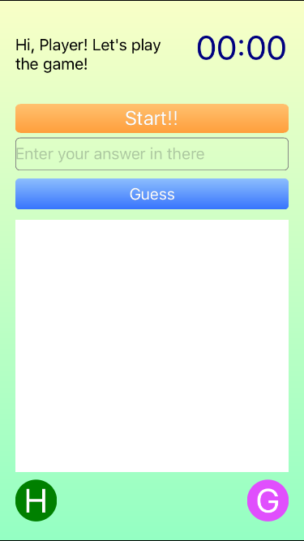
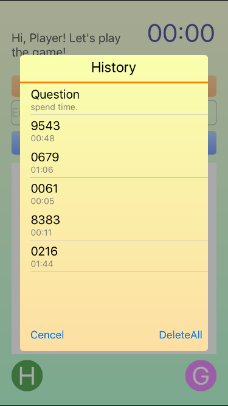

#1A2B

Practice Object - Game 1A2B

##Music

Background Music :03 ゲーム素材 村の曲 (村10)/ 魔王魂

Button Tap : http://www.raywenderlich.com Tutorials

##Screenshots

##Version 2.0

* iOS8.0 later
* only support Portrait
* UI optimal
* modify calculation logic

# Have fun!